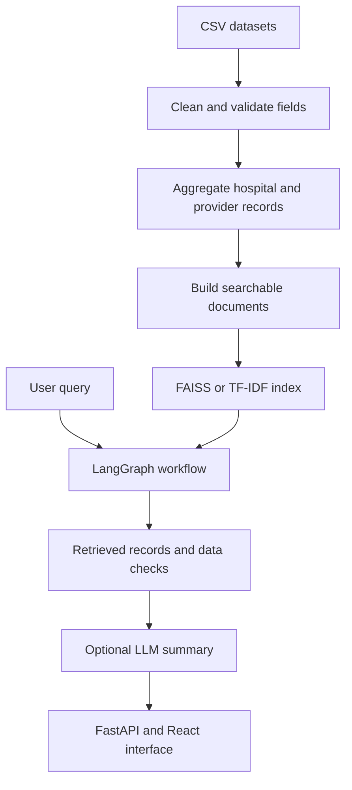

# HealthIQ

HealthIQ is a hospital-data search and analysis application built with FastAPI, React, FAISS, sentence-transformer embeddings, LangGraph, and optional LLM-generated summaries.

The project combines public hospital records, provider data, semantic retrieval, rule-based data-quality checks, and a structured query workflow. It is intended for software and data-engineering experimentation—not for medical diagnosis, treatment, hospital selection, or clinical decision-making.

## Motivation

Public healthcare datasets contain useful information about facilities, services, providers, and quality measures, but the information is often distributed across multiple files and difficult to explore using natural-language questions.

I built HealthIQ to explore how these datasets could be:

- Cleaned and joined into consistent hospital records.
- Converted into searchable text documents.
- Retrieved using both TF-IDF and dense embeddings.
- Checked for missing or potentially inconsistent fields.
- Summarized through a structured workflow.
- Presented through an API and React interface.

The project focuses on data exploration and retrieval. Any generated recommendation is an illustrative rule-based output and should not be interpreted as medical, staffing, financial, or regulatory advice.

## Current Scope

- The application searches a static snapshot of public healthcare data.
- The vector index is built locally from the loaded dataset.
- Data-quality rules inspect the available fields and linked records.
- Gemini or Grok can be configured to summarize retrieved information.
- A deterministic TF-IDF mode is available without an LLM or embedding model.
- The system has not been independently validated for real healthcare operations.

## Architecture



## Query Workflow

Each query passes through five LangGraph nodes that share a structured state object:

1. **Query planning** — extracts the requested location and facility capability.
2. **Retrieval** — searches the FAISS index or TF-IDF fallback.
3. **Record checks** — flags missing fields, low retrieval confidence, and configured data-quality conditions.
4. **Gap calculation** — computes descriptive measures such as service coverage and linked-provider density.
5. **Recommendation mapping** — maps detected conditions to predefined operational suggestions.

An optional LLM converts the structured results into a readable summary. The workflow trace, retrieved records, and calculated fields remain available separately from the generated text.

Calling these stages workflow nodes is more precise than treating each deterministic processing step as an independent autonomous agent.

## Technology

| Layer | Technology |
| --- | --- |
| Workflow orchestration | LangGraph `StateGraph` |
| Dense retrieval | FAISS and `all-MiniLM-L6-v2` |
| Lexical retrieval | TF-IDF fallback |
| Optional text generation | Gemini or Grok provider integration |
| API | FastAPI and Pydantic |
| Lightweight API | Python standard-library server |
| Frontend | React |
| Testing | pytest |

## Data

The documented dataset snapshot contains:

| Data | Records |
| --- | ---: |
| Hospitals | 5,335 |
| Provider rows | 536,723 |
| Searchable documents | Approximately 250,000 |

The project documentation identifies the source files as public CMS datasets. Counts describe the snapshot used by this repository and may differ across dataset releases or preprocessing configurations.

No patient records are used by the documented pipeline.

## Retrieval

### Dense Retrieval

Hospital documents are embedded using `all-MiniLM-L6-v2` and stored in a FAISS inner-product index. Metadata is stored separately and used to filter or interpret retrieved records.

### TF-IDF Fallback

The lightweight mode uses lexical TF-IDF retrieval and deterministic response templates. It avoids the embedding and LLM dependencies and provides a baseline for retrieval evaluation.

### Capability-Aware Reranking

When the query planner identifies a requested capability, such as emergency or cardiac services, the retriever can rerank candidate hospitals using the corresponding structured field.

This reranking combines semantic similarity with an explicit dataset attribute. Its evaluation should therefore be interpreted as hybrid retrieval, not as embedding-only performance.

## Retrieval Evaluation

The repository reports an exploratory evaluation using eight queries with relevance labels derived from state and capability fields.

| Method | Precision@5 | Precision@10 |
| --- | ---: | ---: |
| TF-IDF baseline | 0.42 | 0.39 |
| FAISS with sentence embeddings | 0.90 | 0.91 |
| FAISS with capability-aware reranking | 0.95 | 0.96 |

In this test set, dense retrieval returned more records matching the defined labels than the TF-IDF baseline. Capability-aware reranking produced the highest reported precision.

These values come from only eight queries and a specific rule-based relevance definition. They are useful for checking the implementation and comparing configurations, but they are not sufficient to establish general retrieval performance.

A stronger evaluation would include more queries, multiple relevance judgments, ambiguous requests, failure cases, and metrics such as recall, nDCG, and confidence intervals.

## Data-Quality Checks

The validation stage checks the consistency and completeness of fields available in the loaded snapshot. Example conditions include:

- A facility capability is present but no corresponding provider rows were linked.
- A quality field is missing or outside an expected range.
- A facility has a low reported rating in the source data.
- Retrieved records do not satisfy an explicitly requested capability.

These checks identify conditions in the assembled dataset. For example, “no linked doctor records” means that the ingestion pipeline did not associate provider rows with the facility; it does not establish that the hospital employs no doctors.

The checks are not clinical validation and do not determine whether a facility is safe, appropriate, or adequately staffed.

## Optional RAG Summary

When an LLM provider is configured, the application supplies retrieved records and calculated fields as context for a generated response.

The generated summary is a convenience layer over the structured results. LLM output may omit context, misstate a field, or introduce unsupported language. Users should inspect the retrieved records and source data rather than relying on the generated response alone.

## Quick Start

### Full Local Setup

```bash
git clone https://github.com/dhyanagni2001-commits/Agentic-AI-Healthcare-Intelligence-System.git
cd Agentic-AI-Healthcare-Intelligence-System

python3 -m venv .venv
source .venv/bin/activate
python -m pip install -r requirements.txt
```

Configure an LLM provider only if generated summaries are needed:

```bash
export GEMINI_API_KEY="your-key"
export LLM_PROVIDER="gemini"
```

Start the FastAPI backend:

```bash
uvicorn backend.main_fastapi:app --port 8000
```

Start the frontend in another terminal:

```bash
cd frontend
npm install
npm start
```

The first embedding run builds and stores the FAISS index. Build time depends on the machine, dataset size, and embedding configuration.

### Lightweight Mode

The lightweight server uses TF-IDF retrieval and deterministic response templates:

```bash
python -m pip install pydantic
python3 server.py
```

This mode demonstrates dataset browsing and lexical retrieval without loading FAISS, sentence transformers, or an LLM.

## Local Addresses

| Service | Address |
| --- | --- |
| Backend API | `http://localhost:8000` |
| React frontend | `http://localhost:3000` |
| FastAPI documentation | `http://localhost:8000/docs` |
| Health endpoint | `http://localhost:8000/health` |

## Configuration

| Variable | Required | Default | Purpose |
| --- | --- | --- | --- |
| `GEMINI_API_KEY` | For Gemini summaries | Unset | Authenticate with the configured Gemini provider |
| `GROK_API_KEY` | For Grok summaries | Unset | Authenticate with the configured Grok provider |
| `LLM_PROVIDER` | No | `gemini` | Select the configured LLM integration |

Keep API keys outside source control. The deterministic lightweight mode can be used when no LLM key is configured.

## API

### `GET /health`

Returns service status and index readiness.

### `GET /stats`

Returns descriptive statistics for the loaded dataset snapshot.

### `GET /hospitals`

Returns a paginated list of hospital records. Supported filters include:

- `page`
- `per_page`
- `state`
- `city`
- `has_emergency`
- `min_rating`
- `hospital_type`

Example:

```bash
curl "http://localhost:8000/hospitals?state=TX&city=Houston&page=1"
```

### `GET /hospitals/{facility_id}`

Returns the hospital record associated with a facility identifier in the loaded data.

### `GET /gaps`

Runs the configured descriptive gap calculations for a state or city.

```bash
curl "http://localhost:8000/gaps?state=TX&city=Houston"
```

The output reflects rule-based calculations over the available dataset and is not a clinical or regulatory assessment.

### `POST /query`

Runs the retrieval and analysis workflow.

```json
{
  "query": "Which hospitals in Texas have ICU information?",
  "state_filter": "TX",
  "city_filter": null,
  "include_reasoning": true,
  "max_results": 10
}
```

The response can include:

- A generated or deterministic answer
- A workflow trace
- Calculated gaps
- Rule-based suggestions
- Retrieved documents
- A pipeline confidence value

The workflow trace describes processing stages and outputs; it should not be treated as hidden model chain-of-thought.

### `POST /parse`

Parses supported fields from a free-text hospital description using regular expressions.

```json
{
  "text": "Example Medical Center in Dallas, TX. Has ICU and emergency services.",
  "strict_mode": false
}
```

This endpoint is a rule-based parser, not a general document-understanding model.

### `POST /validate`

Runs configured completeness and consistency checks for a hospital record.

```json
{
  "facility_id": "670055"
}
```

## Project Structure

```text
.
├── backend/
│   ├── agents/
│   │   └── healthcare_agent.py      # LangGraph workflow
│   ├── ingestion/
│   │   ├── aggregate_doctors.py     # Provider aggregation
│   │   ├── clean.py                 # CSV field cleaning
│   │   ├── documents.py             # Search-document construction
│   │   ├── pipeline.py              # Ingestion workflow
│   │   └── schemas_pydantic.py      # Input validation models
│   ├── models/
│   │   └── schemas.py               # Application data structures
│   ├── prompts/
│   │   └── templates.py             # RAG prompt templates
│   ├── services/
│   │   ├── data_loader.py           # Dataset loading and joining
│   │   ├── embedding_service.py     # Sentence-transformer model
│   │   ├── gap_detection.py         # Rule-based descriptive checks
│   │   ├── hybrid_index.py          # FAISS retrieval and reranking
│   │   ├── idp_service.py           # Regex-based text parser
│   │   ├── legacy_tfidf_service.py  # Lexical retrieval fallback
│   │   ├── llm_service.py           # Optional LLM integrations
│   │   ├── rag_pipeline.py          # Retrieval and summary pipeline
│   │   ├── recommendation_engine.py # Rule-to-suggestion mapping
│   │   ├── validation_service.py    # Completeness and consistency rules
│   │   └── vector_store.py          # FAISS index wrapper
│   └── main_fastapi.py              # FastAPI application
├── frontend/                        # React application
├── data/                            # Local data files
├── tests/
│   ├── test_all.py
│   ├── test_embedding_retrieval.py
│   ├── test_main_fastapi.py
│   └── test_rag_pipeline.py
├── server.py                        # Lightweight HTTP server
└── requirements.txt
```

## Tests

Run the core tests without the ML dependencies:

```bash
python3 tests/test_all.py
```

Run them with pytest:

```bash
python3 -m pytest tests/test_all.py -v
```

Run the full integration suite after installing all dependencies:

```bash
python3 -m pytest tests/ -v
```

The test suite covers application logic, API behavior, retrieval integration, and the RAG pipeline. Tests using mocked providers verify control flow but do not validate the behavior of an external LLM service.

## Design Decisions and Tradeoffs

### Dense Retrieval and TF-IDF

Dense embeddings can match related terms that do not share exact tokens. They require additional dependencies, model loading time, memory, and index generation.

TF-IDF is faster to set up and easier to inspect but depends more heavily on lexical overlap.

### Structured Filters and Semantic Search

State, city, and capability requirements can be represented as structured filters rather than inferred only through similarity. Combining filters with semantic retrieval improves control but makes performance dependent on the completeness of structured fields.

### Rule-Based Data Checks

Rules are deterministic and easy to test. However, a flagged record may reflect missing, stale, or incorrectly joined data rather than an actual problem at the facility.

### LLM Summaries

An LLM can make structured output easier to read, but it adds cost, latency, provider dependency, and the possibility of unsupported statements. The underlying records should remain visible for verification.

### Cached Local Index

Persisting the FAISS index reduces restart time. The index must be rebuilt when the source data or document-construction logic changes.

## Limitations

- The retrieval evaluation contains only eight queries.
- Relevance labels are derived from structured state and capability fields.
- The data is a static snapshot and may be incomplete or outdated.
- Linked-provider counts depend on the quality of joins between source files.
- Data-quality flags are heuristic and are not clinical conclusions.
- Rule-based recommendations have not been validated by healthcare professionals.
- LLM-generated summaries may contain unsupported or incorrect statements.
- The project does not provide patient-specific information or medical advice.
- The application has not been security-reviewed for public deployment.
- Performance and load characteristics have not been documented.

## Possible Extensions

- Expand the retrieval evaluation with more queries and independent relevance judgments.
- Add source citations and dataset-version metadata to every returned record.
- Evaluate embedding alternatives and hybrid ranking methods.
- Add automated checks for stale indexes when data changes.
- Measure index build time, query latency, memory use, and API throughput.
- Evaluate LLM summaries for faithfulness to retrieved records.
- Add authentication, authorization, rate limiting, and audit-log controls.
- Review data-quality rules with healthcare-domain experts.
- Replace broad recommendation text with neutral descriptions of observed data conditions.

## What I Learned

This project helped me understand how to combine ingestion, schema validation, semantic retrieval, structured filters, workflow orchestration, and an API around a large public dataset.

It also showed why healthcare-related software requires careful language. A missing linked record is not evidence that a service or employee is absent, a heuristic flag is not clinical validation, and an LLM summary should not replace inspection of the underlying data.
