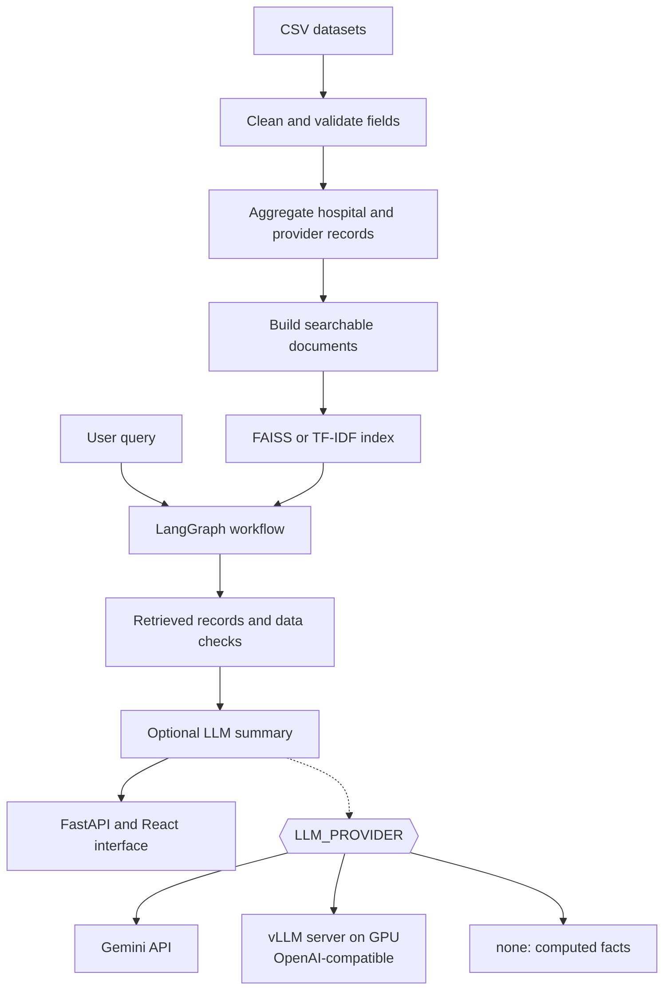

# HealthIQ

HealthIQ is a hospital-data search and analysis application built with FastAPI, React, FAISS, sentence-transformer embeddings, LangGraph, and optional LLM-generated summaries.

The project combines public hospital records, provider data, semantic retrieval, rule-based data-quality checks, and a structured query workflow. It is intended for software and data-engineering experimentation—not for medical diagnosis, treatment, hospital selection, or clinical decision-making.

**Docs:** [Setup and demo](docs/SETUP.md) · [Architecture](docs/ARCHITECTURE.md) · [Serving benchmarks](docs/BENCHMARKS.md) · [Retrieval audit](docs/RETRIEVAL_AUDIT.md)

## Motivation

Public healthcare datasets contain useful information about facilities, services, providers, and quality measures, but the information is often distributed across multiple files and difficult to explore using natural-language questions.

I built HealthIQ to explore how these datasets could be:

- Cleaned and joined into consistent hospital records.
- Converted into searchable text documents.
- Retrieved using both TF-IDF and dense embeddings.
- Checked for missing or potentially inconsistent fields.
- Summarized through a structured workflow.
- Presented through an API and React interface.

The project focuses on data exploration and retrieval. Any generated recommendation is an illustrative rule-based output and should not be interpreted as medical, staffing, financial, or regulatory advice.

## Current Scope

- The application searches a static snapshot of public healthcare data.
- The vector index is built locally from the loaded dataset.
- Data-quality rules inspect the available fields and linked records.
- Gemini, Grok, or a self-hosted vLLM server can be configured to summarize retrieved information; answers can be streamed with their sources.
- Without an LLM, or when the LLM times out or errors, answers fall back to computed facts.
- The API runs locally, in Docker, or on Kubernetes (CPU path validated on kind; the Kubernetes GPU overlay is not yet validated). vLLM itself has been benchmarked on an NVIDIA T4.
- A deterministic TF-IDF mode is available without an LLM or embedding model.
- The system has not been independently validated for real healthcare operations.

## Architecture


```mermaid
flowchart TD
    A[CSV datasets] --> B[Clean and validate fields]
    B --> C[Aggregate hospital and provider records]
    C --> D[Build searchable documents]
    D --> E[FAISS or TF-IDF index]
    F[User query] --> G[LangGraph workflow]
    E --> G
    G --> H[Retrieved records and data checks]
    H --> I[Optional LLM summary]
    I --> J[FastAPI and React interface]
    I -.-> L{{LLM_PROVIDER}}
    L --> M[Gemini API]
    L --> N[vLLM server on GPU<br/>OpenAI-compatible]
    L --> O[none: computed facts]
```

The API pod is CPU-only (embeddings + FAISS). vLLM runs as a separate GPU service reached over its OpenAI-compatible API, so each side scales independently. See [Architecture](docs/ARCHITECTURE.md) for the streaming protocol and deployment layout.

## Query Workflow

Each query passes through five LangGraph nodes that share a structured state object:

1. **Query planning** — extracts the requested location and facility capability.
2. **Retrieval** — searches the FAISS index or TF-IDF fallback.
3. **Record checks** — flags missing fields, low retrieval confidence, and configured data-quality conditions.
4. **Gap calculation** — computes descriptive measures such as service coverage and linked-provider density.
5. **Recommendation mapping** — maps detected conditions to predefined operational suggestions.

An optional LLM converts the structured results into a readable summary. The workflow trace, retrieved records, and calculated fields remain available separately from the generated text.

Calling these stages workflow nodes is more precise than treating each deterministic processing step as an independent autonomous agent.

## Technology

| Layer | Technology |
| --- | --- |
| Workflow orchestration | LangGraph `StateGraph` |
| Dense retrieval | FAISS and `all-MiniLM-L6-v2` |
| Lexical retrieval | TF-IDF fallback |
| Optional text generation | Gemini, Grok, or self-hosted vLLM (OpenAI-compatible) |
| API | FastAPI and Pydantic, server-sent events for streaming |
| Deployment | Docker, Docker Compose, Kubernetes (Kustomize) |
| Benchmarking | Async httpx harness (TTFT, ITL, TPOT, E2E, throughput, errors) |
| Lightweight API | Python standard-library server |
| Frontend | React |
| Testing | pytest |

## Data

The documented dataset snapshot contains:

| Data | Records |
| --- | ---: |
| Hospitals | 5,335 |
| Provider rows | 536,723 |
| Searchable documents (FAISS vectors) | 257,700 |

The project documentation identifies the source files as public CMS datasets. The [retrieval audit](docs/RETRIEVAL_AUDIT.md#data-caveat) found signs that `all_us_hospitals.csv` is synthetic, so treat results as describing this snapshot, not real US hospitals. Counts describe the snapshot used by this repository and may differ across dataset releases or preprocessing configurations.

No patient records are used by the documented pipeline.

## Retrieval

### Dense Retrieval

Hospital documents are embedded using `all-MiniLM-L6-v2` and stored in a FAISS inner-product index. Metadata is stored separately and used to filter or interpret retrieved records.

### TF-IDF Fallback

The lightweight mode uses lexical TF-IDF retrieval and deterministic response templates. It avoids the embedding and LLM dependencies and provides a baseline for retrieval evaluation.

### Capability-Aware Reranking

When the query planner identifies a requested capability, such as emergency or cardiac services, the retriever can rerank candidate hospitals using the corresponding structured field.

This reranking combines semantic similarity with an explicit dataset attribute. Its evaluation should therefore be interpreted as hybrid retrieval, not as embedding-only performance.

## Retrieval Evaluation

An earlier version of this README reported Precision@10 rising from 0.39 (TF-IDF) to 0.96 (FAISS with capability-aware reranking) on eight queries. The scoring script was never committed, and the [audit](docs/RETRIEVAL_AUDIT.md) found the metric circular. The relevance labels are the same capability fields the reranker boosts, about 69% of in-state hospitals already match them, and a plain database filter with no retrieval scores 1.00. The audit also found and fixed a planner bug that made state-scoped queries skip ranking entirely.

Held-out results with 95% bootstrap CIs (`python -m backend.evaluation.retrieval_audit`):

| Held-out test (labels independent of the reranker) | TF-IDF | Dense (FAISS + MiniLM) |
| --- | ---: | ---: |
| Known-item lookup, MRR@10 (40 queries) | 0.24 [0.14, 0.36] | 0.94 [0.88, 0.99] |
| Hospital-type queries, P@10 (16 queries; random in-state = 0.17) | 0.43 | 0.45 [0.31, 0.60] |

Answer quality (grounding of LLM text in retrieved evidence) is measured separately by `backend/evaluation/answer_quality.py`. With a local Qwen2.5-1.5B (4-bit, llama.cpp, temperature 0) on 30 held-out queries:
- no answer cited a hospital absent from the evidence (0/198)
- 3.5% of citations named a hospital in the wrong state
- 2.9% of numbers were unsupported, mostly wrong sums

Every flag was verified by hand ([details](docs/RETRIEVAL_AUDIT.md#answer-quality-kept-separate-from-retrieval)).

## Serving Performance

vLLM 0.31.0 was benchmarked model-only on one NVIDIA T4 (16 GB), serving `Qwen2.5-1.5B-Instruct` in fp16, with streaming, 128 max output tokens, 64 requests per level and 0 errors at every level ([full report](docs/BENCHMARKS.md#verified-result-vllm-on-an-nvidia-t4-model-only)):

| Concurrent requests | Output tok/s | Time to first token p50 | Per-token latency p50 |
| ---: | ---: | ---: | ---: |
| 1 | 54 | 41 ms | 18 ms |
| 8 | 431 | 52 ms | 16 ms |
| 32 | 1,060 | 105 ms | 23 ms |

- **Batching:** continuous batching raised throughput about 20× from 1 to 32 concurrent requests, while per-token latency rose only from 18 to 23 ms.
- **Hardware limit:** single-request decoding reached about 59% of the T4's memory-bandwidth limit, which is about 11 ms per token for these 3.24 GiB of weights.
- **Short prompts only:** the prompts were about 50 tokens. Real HealthIQ prompts carry retrieved evidence (about 450–800 tokens: 10 snippets of up to 220 characters plus facts), so time to first token will be higher. That end-to-end run is still pending.
- **Laptop comparison:** for contrast, llama.cpp on an Apple M5 Pro (4-bit model, 4 request slots) plateaued at 369 tok/s with 1.2 s time to first token at 8 concurrent requests.

## Data-Quality Checks

The validation stage checks the consistency and completeness of fields available in the loaded snapshot. Example conditions include:

- A facility capability is present but no corresponding provider rows were linked.
- A quality field is missing or outside an expected range.
- A facility has a low reported rating in the source data.
- Retrieved records do not satisfy an explicitly requested capability.

These checks identify conditions in the assembled dataset. For example, “no linked doctor records” means that the ingestion pipeline did not associate provider rows with the facility; it does not establish that the hospital employs no doctors.

The checks are not clinical validation and do not determine whether a facility is safe, appropriate, or adequately staffed.

## Optional RAG Summary

When an LLM provider is configured, the application supplies retrieved records and calculated fields as context for a generated response. `POST /query/stream` streams that response token by token, sending the retrieved sources first and repeating their IDs at the end, so citations survive even if generation fails mid-stream.

The generated summary is a convenience layer over the structured results. LLM output may omit context, misstate a field, or introduce unsupported language. Users should inspect the retrieved records and source data rather than relying on the generated response alone.

## Quick Start

### Full Local Setup

```bash
git clone https://github.com/dhyanagni2001-commits/Agentic-AI-Healthcare-Intelligence-System.git
cd Agentic-AI-Healthcare-Intelligence-System

python3 -m venv .venv
source .venv/bin/activate
python -m pip install -r requirements.txt
```

Configure an LLM provider only if generated summaries are needed:

```bash
export GEMINI_API_KEY="your-key"
export LLM_PROVIDER="gemini"
```

Start the FastAPI backend:

```bash
uvicorn backend.main_fastapi:app --port 8000
```

Start the frontend in another terminal:

```bash
cd frontend
npm install
npm start
```

The first embedding run builds and stores the FAISS index (257,700 vectors in 72 s on an Apple M5 Pro). Later starts load it from `data/vector_index/`.

### Self-Hosted vLLM

On a machine with an NVIDIA GPU:

```bash
vllm serve Qwen/Qwen2.5-1.5B-Instruct --port 8001 --max-model-len 4096
LLM_PROVIDER=vllm VLLM_BASE_URL=http://localhost:8001/v1 VLLM_MODEL=Qwen/Qwen2.5-1.5B-Instruct \
  uvicorn backend.main_fastapi:app --port 8000
```

Without an NVIDIA GPU, any OpenAI-compatible server works with the same settings. For example, llama.cpp runs a real model on a laptop:

```bash
llama-server -hf Qwen/Qwen2.5-1.5B-Instruct-GGUF:Q4_K_M --port 8001 --alias qwen2.5-1.5b-instruct-q4_k_m
LLM_PROVIDER=vllm VLLM_BASE_URL=http://localhost:8001/v1 VLLM_MODEL=qwen2.5-1.5b-instruct-q4_k_m \
  uvicorn backend.main_fastapi:app --port 8000
```

`python -m benchmarks.mock_openai_server --port 8001` is a model-free stub for demoing the streaming transport.

### Docker and Kubernetes

```bash
docker compose up --build api                         # CPU, no LLM
LLM_PROVIDER=vllm docker compose --profile gpu up     # API + vLLM on one GPU
kubectl apply -k deploy/k8s/overlays/kind             # local CPU cluster (see docs/SETUP.md)
kubectl apply -k deploy/k8s/overlays/gpu              # API + vLLM; needs the NVIDIA device plugin
python deploy/smoke_test.py http://localhost:8000     # post-deploy checks
```

Full steps, including kind cluster creation and the mock-LLM profile, are in [docs/SETUP.md](docs/SETUP.md).

### Lightweight Mode

The lightweight server uses TF-IDF retrieval and deterministic response templates:

```bash
python -m pip install pydantic
python3 server.py
```

This mode demonstrates dataset browsing and lexical retrieval without loading FAISS, sentence transformers, or an LLM.

## Local Addresses

| Service | Address |
| --- | --- |
| Backend API | `http://localhost:8000` |
| React frontend | `http://localhost:3000` |
| FastAPI documentation | `http://localhost:8000/docs` |
| Health endpoint | `http://localhost:8000/health` |
| Readiness endpoint | `http://localhost:8000/ready` |

## Configuration

| Variable | Required | Default | Purpose |
| --- | --- | --- | --- |
| `GEMINI_API_KEY` | For Gemini summaries | Unset | Authenticate with the configured Gemini provider |
| `GROK_API_KEY` | For Grok summaries | Unset | Authenticate with the configured Grok provider |
| `LLM_PROVIDER` | No | `gemini` | `gemini`, `vllm`, `grok`, or `none` |
| `VLLM_BASE_URL` / `VLLM_MODEL` | For vLLM | Unset | OpenAI-compatible vLLM endpoint and served model name |
| `LLM_TIMEOUT_S` / `LLM_MAX_RETRIES` / `LLM_MAX_TOKENS` | No | 30 / 1 / 512 | Per-request limits for every provider |

Keep API keys outside source control. The deterministic lightweight mode can be used when no LLM key is configured. Any LLM timeout or upstream error falls back to computed facts instead of failing the request.

## API

### `GET /health`

Returns service status and index readiness. Used as the liveness and startup probe.

### `GET /ready`

Returns 503 until the index is loaded, and reports LLM provider status. Used as the readiness probe.

### `POST /query/stream`

Server-sent events over the RAG pipeline: `sources` first, then `token` chunks, then `done` with the same `source_ids` and timings. See [Architecture](docs/ARCHITECTURE.md#streaming-protocol-post-querystream-textevent-stream).

### `GET /stats`

Returns descriptive statistics for the loaded dataset snapshot.

### `GET /hospitals`

Returns a paginated list of hospital records. Supported filters include:

- `page`
- `per_page`
- `state`
- `city`
- `has_emergency`
- `min_rating`
- `hospital_type`

Example:

```bash
curl "http://localhost:8000/hospitals?state=TX&city=Houston&page=1"
```

### `GET /hospitals/{facility_id}`

Returns the hospital record associated with a facility identifier in the loaded data.

### `GET /gaps`

Runs the configured descriptive gap calculations for a state or city.

```bash
curl "http://localhost:8000/gaps?state=TX&city=Houston"
```

The output reflects rule-based calculations over the available dataset and is not a clinical or regulatory assessment.

### `POST /query`

Runs the retrieval and analysis workflow.

```json
{
  "query": "Which hospitals in Texas have ICU information?",
  "state_filter": "TX",
  "city_filter": null,
  "include_reasoning": true,
  "max_results": 10
}
```

The response can include:

- A generated or deterministic answer
- A workflow trace
- Calculated gaps
- Rule-based suggestions
- Retrieved documents
- A pipeline confidence value

The workflow trace describes processing stages and outputs; it should not be treated as hidden model chain-of-thought.

### `POST /parse`

Parses supported fields from a free-text hospital description using regular expressions.

```json
{
  "text": "Example Medical Center in Dallas, TX. Has ICU and emergency services.",
  "strict_mode": false
}
```

This endpoint is a rule-based parser, not a general document-understanding model.

### `POST /validate`

Runs configured completeness and consistency checks for a hospital record.

```json
{
  "facility_id": "670055"
}
```

## Project Structure

```text
.
├── backend/
│   ├── evaluation/
│   │   ├── retrieval_audit.py       # P@10 / nDCG@10 / MRR@10 on held-out queries
│   │   ├── answer_quality.py        # Answer grounding (separate from retrieval)
│   │   └── retrieval_queries.jsonl  # Frozen dev + held-out query set
│   ├── agents/
│   │   └── healthcare_agent.py      # LangGraph workflow
│   ├── ingestion/
│   │   ├── aggregate_doctors.py     # Provider aggregation
│   │   ├── clean.py                 # CSV field cleaning
│   │   ├── documents.py             # Search-document construction
│   │   ├── pipeline.py              # Ingestion workflow
│   │   └── schemas_pydantic.py      # Input validation models
│   ├── models/
│   │   └── schemas.py               # Application data structures
│   ├── prompts/
│   │   └── templates.py             # RAG prompt templates
│   ├── services/
│   │   ├── data_loader.py           # Dataset loading and joining
│   │   ├── embedding_service.py     # Sentence-transformer model
│   │   ├── gap_detection.py         # Rule-based descriptive checks
│   │   ├── hybrid_index.py          # FAISS retrieval and reranking
│   │   ├── idp_service.py           # Regex-based text parser
│   │   ├── legacy_tfidf_service.py  # Lexical retrieval fallback
│   │   ├── llm_service.py           # Gemini / vLLM / Grok providers, timeouts, streaming
│   │   ├── rag_pipeline.py          # Retrieval and summary pipeline
│   │   ├── recommendation_engine.py # Rule-to-suggestion mapping
│   │   ├── validation_service.py    # Completeness and consistency rules
│   │   └── vector_store.py          # FAISS index wrapper
│   └── main_fastapi.py              # FastAPI application
├── benchmarks/                      # Streaming benchmark, workload, mock OpenAI server, results
├── deploy/                          # Kustomize (base, gpu, kind), smoke_test.py
├── docs/                            # Setup, architecture, benchmarks, retrieval audit
├── reports/                         # Retrieval-audit and answer-quality outputs
├── frontend/                        # React application
├── data/                            # Local data files
├── tests/
│   ├── test_all.py
│   ├── test_embedding_retrieval.py
│   ├── test_llm_streaming.py        # vLLM failures, SSE, sources, smoke, harness
│   ├── test_main_fastapi.py
│   └── test_rag_pipeline.py
├── Dockerfile / docker-compose.yml  # CPU image; mock and gpu profiles
├── server.py                        # Lightweight HTTP server
└── requirements.txt
```

## Tests

Run the core tests without the ML dependencies:

```bash
python3 tests/test_all.py
```

Run them with pytest:

```bash
python3 -m pytest tests/test_all.py -v
```

Run the full integration suite after installing all dependencies:

```bash
python3 -m pytest tests/ -v
```

The test suite (106 tests) covers application logic, API behavior, retrieval integration, the RAG pipeline, the vLLM provider against an OpenAI-compatible stub (timeouts, 5xx, dropped streams), SSE event order and source preservation, deployment smoke checks, and the benchmark harness. Tests using mocked providers verify control flow but do not validate the behavior of an external LLM service.

## Design Decisions and Tradeoffs

### Dense Retrieval and TF-IDF

Dense embeddings can match related terms that do not share exact tokens. They require additional dependencies, model loading time, memory, and index generation.

TF-IDF is faster to set up and easier to inspect but depends more heavily on lexical overlap.

### Structured Filters and Semantic Search

State, city, and capability requirements can be represented as structured filters rather than inferred only through similarity. Combining filters with semantic retrieval improves control but makes performance dependent on the completeness of structured fields.

### Rule-Based Data Checks

Rules are deterministic and easy to test. However, a flagged record may reflect missing, stale, or incorrectly joined data rather than an actual problem at the facility.

### LLM Summaries

An LLM can make structured output easier to read, but it adds cost, latency, provider dependency, and the possibility of unsupported statements. The underlying records should remain visible for verification.

### vLLM Behind an HTTP API

vLLM is called through its OpenAI-compatible server rather than embedded in the API process. The API image stays CPU-only and small, the GPU service scales separately, and any OpenAI-compatible server can replace it. The cost is one extra network hop per request.

### Streaming With Sources First

The stream sends retrieved sources before any tokens. Clients can show citations immediately, and a failure mid-generation still leaves the answer attributable. Timeouts and upstream errors become an `error` event plus a computed-facts fallback rather than a broken response.

### Evaluating Retrieval Separately From Answers

Retrieval quality (are the right records returned?) and answer quality (does the text stay within those records?) fail in different ways, so they are measured by separate tools. Retrieval labels must not come from the same fields the ranker uses, otherwise the metric rewards reading the label; see the [audit](docs/RETRIEVAL_AUDIT.md).

### Cached Local Index

Persisting the FAISS index reduces restart time. The index must be rebuilt when the source data or document-construction logic changes.

## Limitations

- Retrieval labels are rule-derived, not human judgments; see the [audit](docs/RETRIEVAL_AUDIT.md).
- `data/all_us_hospitals.csv` shows signs of being synthetic (see the audit's data caveat).
- vLLM has been benchmarked model-only on a single T4 ([results](docs/BENCHMARKS.md#verified-result-vllm-on-an-nvidia-t4-model-only)); HealthIQ end to end on vLLM and the Kubernetes GPU overlay are [still pending](docs/BENCHMARKS.md#still-pending).
- The RAG and streaming path does not apply the planner's state filter, so hospitals from other states can reach the answer (e.g. York, PA for a New York query).
- The data is a static snapshot and may be incomplete or outdated.
- Linked-provider counts depend on the quality of joins between source files.
- Data-quality flags are heuristic and are not clinical conclusions.
- Rule-based recommendations have not been validated by healthcare professionals.
- LLM-generated summaries may contain unsupported or incorrect statements.
- The project does not provide patient-specific information or medical advice.
- The application has not been security-reviewed for public deployment.
- Load characteristics are documented for the CPU application path, llama.cpp on a laptop, and vLLM on a single T4 ([benchmarks](docs/BENCHMARKS.md)).

## Possible Extensions

- Run HealthIQ end to end on vLLM, plus the answer-grounding evaluation with the fp16 model ([commands](docs/BENCHMARKS.md#still-pending)).
- Apply planner state/city filters to documents in the RAG and streaming path, before the prompt is built.
- Add human relevance judgments to the retrieval evaluation.
- Batch query embeddings or move them to the GPU; CPU retrieval is the bottleneck under concurrent load.
- Bake the index into a read-only volume so the API can run more than one replica.
- Use the streaming endpoint in the React frontend.
- Add dataset-version metadata to every returned record.
- Evaluate embedding alternatives and hybrid ranking methods.
- Add automated checks for stale indexes when data changes.
- Add authentication, authorization, rate limiting, and audit-log controls.
- Review data-quality rules with healthcare-domain experts.
- Replace broad recommendation text with neutral descriptions of observed data conditions.

## What I Learned

This project helped me understand how to combine ingestion, schema validation, semantic retrieval, structured filters, workflow orchestration, and an API around a large public dataset.

It also showed why healthcare-related software requires careful language. A missing linked record is not evidence that a service or employee is absent, a heuristic flag is not clinical validation, and an LLM summary should not replace inspection of the underlying data.
